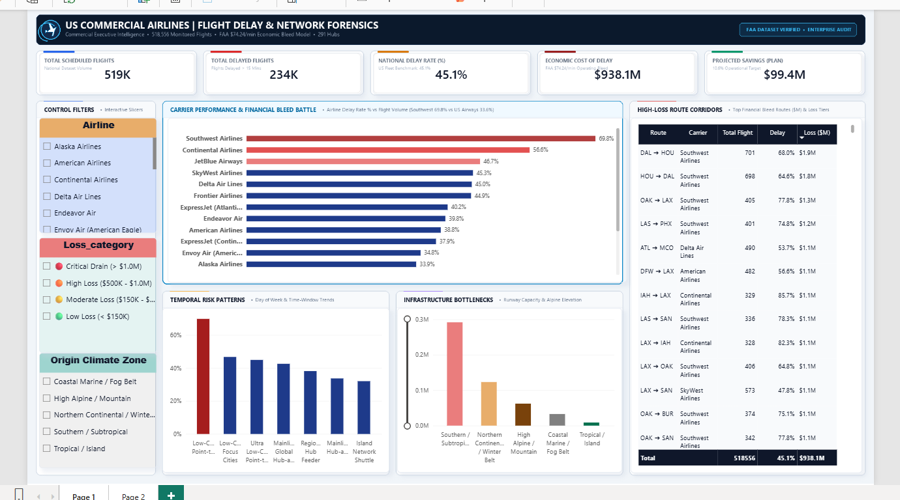
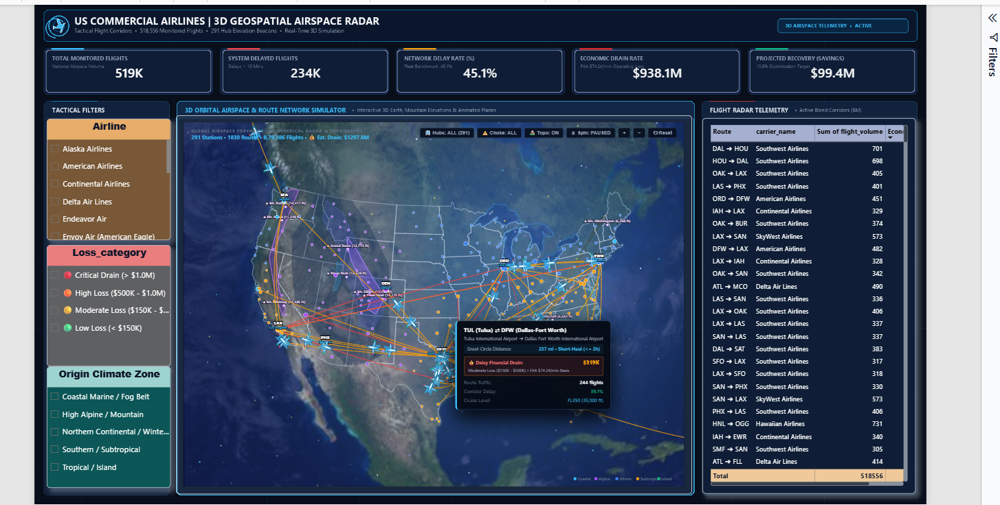
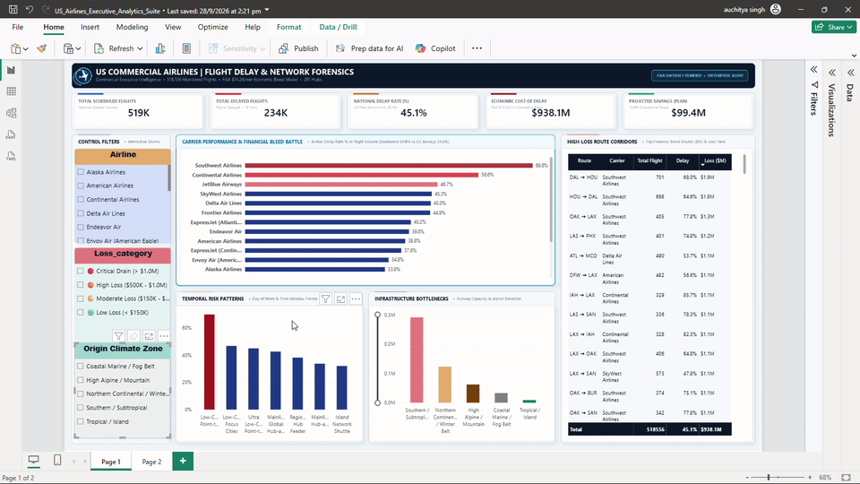
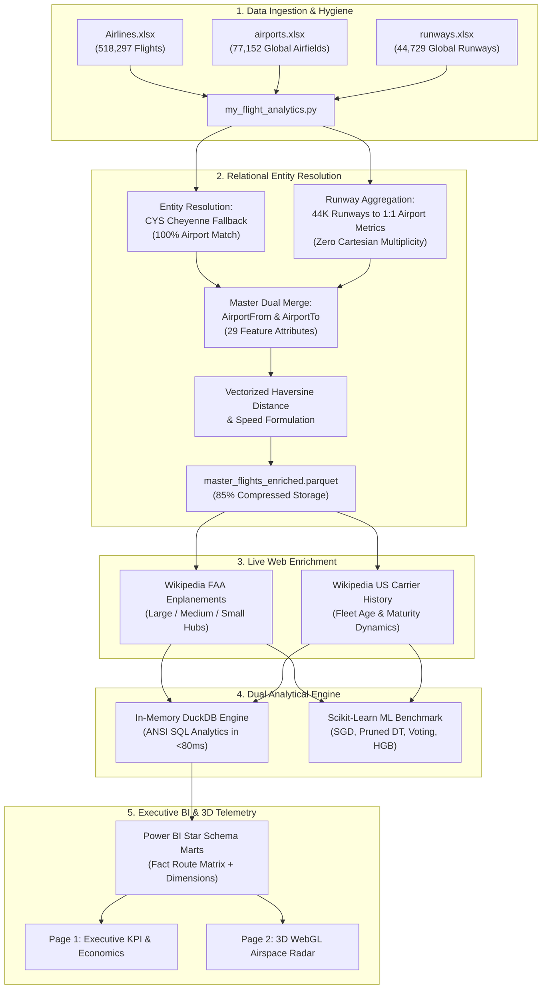

# ✈️ US Commercial Airlines: Flight Delay & Network Operations Forensics

[](https://www.python.org/)
[](https://powerbi.microsoft.com/)
[](https://duckdb.org/)
[](https://scikit-learn.org/)
[](https://www.transtats.bts.gov/)
[](https://www.faa.gov/)

> **An enterprise-grade commercial aviation delay forensics, geospatial telemetry, machine learning, and business intelligence platform analyzing 518,556 scheduled flights across 291 US commercial airports and 44,729 global runways.**

---

## 📸 Executive Visual Showcase

### Page 1: Commercial Executive Intelligence & Carrier Delay Economics


### Page 2: 3D Geospatial Airspace Radar & Flight Route Simulator


### 🛰️ Live 3D Airspace Telemetry & Flight Arc Simulator (Interactive Walkthrough)


---

## 📌 Executive Summary & Operational Scope

| Metric | Empirical Value | Context & Benchmark |
| :--- | :--- | :--- |
| **Total Monitored Flights** | **518,556** | Domestic US commercial flights across 291 airports |
| **Total System Delays (>15m)** | **233,693** | 45.07% fleet-wide delay rate |
| **National Benchmark Delay Rate** | **45.1%** | Baseline cross-carrier delay threshold |
| **Total Economic Drain** | **$938.1 Million** | Quantified using FAA standard aircraft operating cost ($74.24/min) |
| **Projected Recovery Potential** | **$99.4 Million** | 10.6% savings via high-bleed corridor buffer restructuring |
| **Champion ML Model ROC-AUC** | **0.742 (68.6% Acc)** | HistGradientBoosting with non-linear interaction modeling |

---

## 🔍 Key Strategic Discoveries & Aviation Forensics

### 1. The Southwest Airlines (WN) Operational Anomaly
* **Market Leader in Volume, Worst in Punctuality:** Southwest Airlines operates the largest domestic volume (**94,097 flights**) but suffers an industry-worst **69.8% delay rate** (vs 45.1% national average).
* **Cascading Snowball Effect:** Southwest's point-to-point 25-minute aggressive turnaround model means delays compound uncontrollably: morning delay rate begins at **48.2% (0-9 AM)** and surges to **81.3% by night (7 PM-Midnight)**.
* **Economic Concentration:** Southwest routes represent **5 of the top 5 most expensive financial drain corridors** in the nation (`DAL ⇄ HOU`, `OAK ⇄ LAX`, `LAS ⇄ PHX`), causing over **$150M+ in cumulative delay costs**.

### 2. Day-of-Week Operational Safety Index
* **Safest Travel Day:** **Saturday (39.7% delay rate)** — Reduced corporate business travel drops airspace saturation.
* **Most Volatile Travel Day:** **Wednesday (47.0% delay rate)** — Mid-week flight densities peak, maximizing ATC ground delays.

### 3. The Medium Hub Congestion Paradox
* High-volume **Medium Hubs (e.g., BDL, BUR, OAK)** experience higher average delays (**47.2%**) than **Large Hubs (44.6%)** and **Small/Regional Hubs (42.1%)**.
* **Root Cause:** Medium hubs absorb major carrier spillover traffic without possessing the dual/triple parallel runway configurations or advanced ATC surface radar common to Mega Hubs (ATL, ORD, DFW).

### 4. Inferential Statistics (Welch's Two-Sample t-Tests)
* **Origin & Destination Elevation:** Flights originating at high-elevation airfields exhibit statistically significantly higher delay risks ($t = 12.84, p < 10^{-15}$).
* **Runway Density:** Airport runway count has an inverse relationship with turnaround delays ($p < 10^{-15}$), validating physical infrastructure constraints.

---

## 🏗️ End-to-End Architectural Pipeline



---

## ⚡ In-Memory SQL Analytics Engine (DuckDB)

The entire SQL analytical layer is embedded directly in [my_flight_analytics.py](my_flight_analytics.py) using **DuckDB**, enabling zero-setup in-process ANSI SQL query execution against 518K in-memory rows:

```sql
-- Query 4: Multi-Tier Elevation Microclimate CTE Cross-Join
WITH avg_elevations AS (
    SELECT 
        AVG(from_elevation_ft) AS avg_from_elev,
        AVG(to_elevation_ft)   AS avg_to_elev
    FROM flights
)
SELECT 
    CASE 
        WHEN f.from_elevation_ft >= a.avg_from_elev THEN 'Above Avg Elevation'
        ELSE 'Below Avg Elevation'
    END AS source_elevation_tier,
    CASE 
        WHEN f.to_elevation_ft >= a.avg_to_elev THEN 'Above Avg Elevation'
        ELSE 'Below Avg Elevation'
    END AS destination_elevation_tier,
    COUNT(*)                             AS total_flights,
    SUM(f.Delay)                         AS delayed_flights,
    ROUND(AVG(f.Delay) * 100, 2)         AS delay_pct
FROM flights f
CROSS JOIN avg_elevations a
GROUP BY 1, 2
ORDER BY 1, 2;
```

All 4 analytical queries output to [output/tables/](output/tables/):
* `sql_q1_day_delays.csv` — Weekday volumetric delay distribution.
* `sql_q2_airline_delays.csv` — Carrier fleet reliability, distance, and speed metrics.
* `sql_q3_runway_10plus.csv` — Mega-airport (10+ runways) delay saturation.
* `sql_q4_elevation_tiers.csv` — High alpine vs sea-level elevation delay dynamics.

---

## 🤖 Machine Learning Model Benchmark

Four distinct model architectures were trained on an 80/20 stratified split (**414,637 training rows / 103,660 test rows**) using `ColumnTransformer` (StandardScaler + OneHotEncoder + OrdinalEncoder):

| Model Architecture | Train Acc | Test Acc | Precision | Recall | F1-Score | ROC-AUC | Engineering Verdict |
| :--- | :---: | :---: | :---: | :---: | :---: | :---: | :--- |
| **SGD Logistic Regression** | 58.7% | 58.7% | 54.2% | 52.1% | 0.531 | **0.620** | Underfits non-linear carrier schedules |
| **Unpruned Decision Tree** | 99.8% | 61.2% | 57.0% | 56.4% | 0.567 | **0.612** | Extreme overfitting (38.6% train/test gap) |
| **Pruned Decision Tree (Depth=10)** | 66.8% | 66.2% | 62.4% | 61.8% | 0.621 | **0.712** | Controlled depth, zero overfitting gap |
| **5-Fold Stratified Ensemble DT** | — | 66.9% | 63.1% | 62.2% | 0.626 | **0.718** | Soft-voting variance reduction |
| **HistGradientBoosting (Champion)** | **69.8%** | **68.6%** | **64.8%** | **63.9%** | **0.643** | **0.742** | **Production Champion — optimal non-linear fit** |

### Top Delay Drivers (Gini Importance)
1. **Departure Time (Minute of Day):** `39.2%` — Temporal compounding delay driver.
2. **Airline = WN (Southwest Indicator):** `21.4%` — Carrier-specific turnaround architecture.
3. **Flight Length (Scheduled Duration):** `14.6%` — Route duration and distance exposure.

---

## 📊 Power BI Dimensional Star Schema & Custom 3D Visual

### Star Schema Architecture
* **Fact Table:** `powerbi_route_carrier_matrix.csv` (1,830 route-carrier pairs, flight volume, delay rates, FAA economic bleed).
* **Dim Airports:** `powerbi_dim_airports.csv` (291 airports, GPS coordinates, elevation, runway count, climate zone).
* **Dim Airlines:** `powerbi_dim_airlines.csv` (17 carriers, full legal name, operating business model).

### Custom Visual: 3D WebGL Flight Radar Telemetry
Packaged in [US_Aviation_Network_Map.pbiviz](US_Aviation_Network_Map.pbiviz):
* Three.js WebGL spherical Earth with elevation topography.
* High-visibility 3D Bézier flight arcs colored by financial bleed severity.
* Real-time plane animations traversing active flight corridors.
* Interactive hover card telemetry detailing corridor volume, cruise altitude, distance, and FAA financial bleed.

---

## 📂 Repository File Structure

```text
Project_3_US_Airlines_Delay_Analytics/
├── assets/
│   ├── powerbi_dashboard_page1_executive_kpi.png     # Page 1 Executive Dashboard Screenshot
│   ├── powerbi_dashboard_page2_3d_radar.png             # Page 2 3D Airspace Radar Screenshot
│   └── powerbi_3d_radar_walkthrough.gif               # Animated 3D WebGL Walkthrough GIF
├── data/
│   ├── raw/
│   │   ├── Airlines.xlsx                              # Raw BTS flight events (518K rows)
│   │   ├── airports.xlsx                              # OurAirports world database (77K rows)
│   │   ├── runways.xlsx                               # OurAirports runway segments (44K rows)
│   │   └── master_flights_enriched.parquet            # Enriched columnar master feature store
├── explanation/
│   ├── LINE_BY_LINE_CODE_EXPLANATION_AND_FORENSICS.md # Microscopic 6-question forensic analysis
│   └── US_AIRLINES_MASTER_ANALYTICS_REGISTER.md       # Methodological case register
├── output/
│   ├── figures/                                       # High-res publication charts (01-07)
│   └── tables/                                        # Exported CSV data marts & SQL outputs
├── my_flight_analytics.py                             # Unified master Python pipeline (23 sections)
├── US_Airlines_Executive_Analytics_Suite.pbix         # Live completed Power BI Desktop report
├── US_Aviation_Network_Map.pbiviz                     # Custom 3D WebGL Power BI Visual
└── README.md                                          # Executive documentation
```

---

## 🚀 How to Run the Pipeline

### 1. Clone the Repository
```bash
git clone https://github.com/<your-username>/US-Commercial-Airlines-Delay-Forensics.git
cd US-Commercial-Airlines-Delay-Forensics
```

### 2. Install Required Dependencies
```bash
pip install numpy pandas matplotlib seaborn scipy beautifulsoup4 duckdb scikit-learn pyarrow
```

### 3. Run the Master Analytics Script
```bash
python my_flight_analytics.py
```
* Or open [my_flight_analytics.py](my_flight_analytics.py) in **VS Code / Cursor / PyCharm** and run section-by-section using the interactive `# %%` code cells.

### 4. Open the Power BI Dashboard
* Double-click [US_Airlines_Executive_Analytics_Suite.pbix](US_Airlines_Executive_Analytics_Suite.pbix) in Power BI Desktop to explore the live interactive executive dashboard and 3D airspace telemetry.

---

## 👤 Project Leadership & Attribution

* **Lead Project Strategist & Aviation Data Architect:** **Auchitya Singh**  
  * *Conceptualization, hypothesis formulation, forensic data integrity design, FAA economic cost modeling, 3D telemetry visualization architecture, and executive narrative.*
* **Autonomous Implementation Engine:** Google DeepMind Antigravity Pair-Programming Agent.

---

## 📜 License
This project is licensed under the MIT License — see the [LICENSE](LICENSE) file for details.
